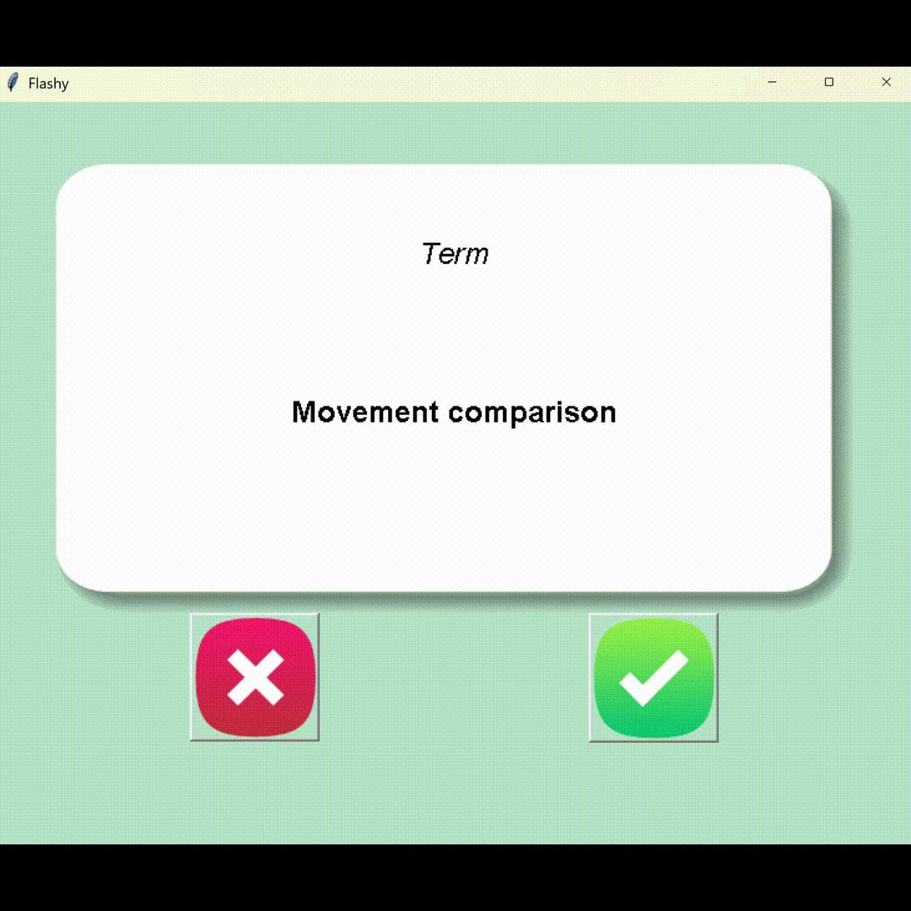

# Physics Flashcards 🎓⚡



Welcome to **Physics Flashcards**! This project is a simple and dynamic flashcard application built using Python and Tkinter. It is designed to help you master physics concepts quickly and interactively.

## 🌟 Features

- 📚 **Interactive Flashcards**: Learn physics terms and their meanings with interactive flip animations.
- 🕒 **Dynamic Flip Timer**: The cards flip dynamically based on the length of the term for an optimized learning experience.
- 🌍 **CSV-based Custom Content**: Easily customize the flashcards by editing the CSV file.
- 🖼️ **Dynamically Scaled UI**: The interface dynamically adjusts based on your screen size.
- 💾 **Progress Tracking**: Cards marked as known are saved to track your learning progress.

## 🚀 Getting Started

### Prerequisites

Make sure you have the following installed:
- Python 3.x
- Required dependencies listed in `requirements.txt`

### Installation

1. Clone the repository:
   ```bash
   git clone https://github.com/raimonvibe/physics_flashcards.git
   cd physics_flash-card
   ```

2. Install dependencies:
   ```bash
   pip install -r requirements.txt
   ```

### Running the Application

Run the application using the following command:
```bash
python main.py
```

## 📂 Project Structure
```
physics-flashcards/
├── data/
│   └── physics_translated.csv   # CSV file containing terms and meanings
├── images/
│   ├── card_front.png           # Front side of the card
│   ├── card_back.png            # Back side of the card
│   ├── right.png                # Correct answer button image
│   └── wrong.png                # Incorrect answer button image
├── main.py                      # Main program logic
├── psysics-flashcards.gif       # Demo GIF showcasing the app
├── requirements.txt             # Python dependencies
└── README.md                    # Project documentation
```

## 🛠️ Customizing the Flashcards

To customize the terms and their meanings, edit the `physics_translated.csv` file inside the `data/` folder. Add new rows for additional flashcards:
```
Term,Meaning
Velocity,The speed of an object in a given direction
Kinetic Energy,Energy an object possesses due to its motion
...
```

## ✨ Features to Explore

- Modify the flip timer duration to match your learning speed.
- Customize the UI with different fonts or background colors.
- Add new categories of flashcards beyond physics.

## 📜 License
This project is open-source and available under the [MIT License](./LICENSE).

## 🤝 Contributing
We welcome contributions! Feel free to open issues or submit pull requests.

## 🙌 Acknowledgments
Special thanks to all contributors and the Python community for making this project possible.
